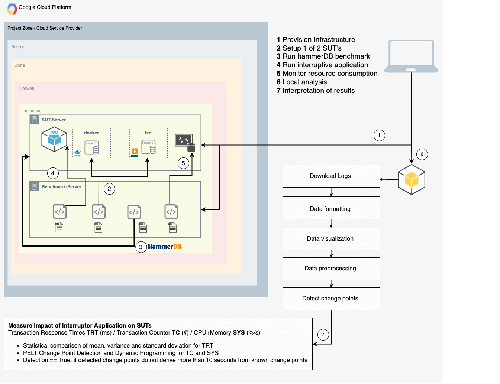

# Scalable Software Systems Project WS23/24 - TU Berlin@3S



This project presents an initial stage experiment framework to measure interference during duet benchmarking in cloud environments. The repository is accompanied by a report that furtherly explains the context of the implementation.

- [Click to read the Paper.](./Docs/Paper/464308_pj_ssws_report.pdf)

**Disclaimer**
This implementation made use of HammerDB:
- https://www.hammerdb.com/docs/

## Project Structure

**Directory:**

```CloudSetup/Infrastructure/BenchmarkSetup/Ansible/Scripts```

- `cleanup.sh`: Detects the present SUT on your server and deletes it. Data will be lost!
- `resource_monitor.sh`: Detects the present SUT and monitors CPU and Memory usage in 2second intervals.
- `run_benchmark.sh`: Main execution script. Verifys connection with SUT and triggers HammerDB CLI to run the benchmark. IP Adresses are passed by Ansible to the host. This script writes these adresses into HammerDBs tcl files. When encountering connectivity issues double check the IP-Adresses contained in /opt/postgres-server-ip.txt
- `run_interruptor.sh`: Triggers the Interruptor application exhaustor.go to be executed with a 5 minute delay.
- `setup_docker_pg.sh`: Launches a docker container with the latest postgres server.
- `setup_lxc_pg.sh`: Launches a linux container with a postgres-server.
- `wizard.sh`: Serves as the user interface for the benchmark experiments.
- `etprof-1.1.tmp`: Contains the adjusted tcl implementation of HammerDBs time profiling module. 
- `pg_tprocc_run_new.tcl`: Contains the adjusted HammerDB tcl implementation to preset a different configuration than default.

**Directory:**

```CloudSetup/Infrastructure/BenchmarkSetup/InterruptorApplication```

-`exhaustor.go`: Contains the implementation of a resource-intensive program.

**Directory:**

```CloudSetup/ExperimentsAndResults```

This directory holds the data and the notebooks for analyzing the benchmark data. The notebooks follow a strict structure for preprocessing, plotting and applying change point detection algorithm per metric.

### Dependencies

Ensure you have the following requirements:
   - [Google Cloud project](https://cloud.google.com/resource-manager/docs/creating-managing-projects#creating_a_project).
   - Shell environment with `gcloud`, `git`, `terraform` and `python3, pyhton3-pip` as well as`Jupyter-notebook`available on your system.

1. Clone the repository.

```sh
git clone https://github.com/Niklasfomin/Scalable-Software-Systems-PJ-TU-Berlin.git
cd Scalable-Software-Systems-PJ-TU-Berlin
```

2. Setup your gcloud environment
```sh
export PROJECT_ID=<PROJECT_ID>
export REGION=<REGION>
```

Substitute `<PROJECT_ID>` with the ID of your Google Cloud project.

**Prerequesite**

Because the SUT-server should run virtual machines in the future nested virtualization is required. Follow the steps to create a base image:

```
gcloud compute instances create temp-image-base --image-family=projects/ubuntu-os-cloud/global/images/family/ubuntu-2004-lts --zone=<ZONE>

gcloud compute instances stop temp-image-base --zone=us-central1-b

gcloud compute images create nested-vm-image \
  --source-disk=temp-image-base --source-disk-zone=<ZONE> \
  --licenses="https://www.googleapis.com/compute/v1/projects/vm-options/global/licenses/enable-vmx"

```

## User Guide

To deploy and run the experiment setup follow the instructions:

**1. Navigate to Scalable-Software-Systems-PJ-TU-Berlin/CloudSetup/Infrastructure/Terraform**

Make sure to have an activated Google SVA (service-account) with an activated key saved on your localhost.

Within the `Terraform` directory create a new file `terraform.tfvars`.

Add the following lines to this file and save it:

```
credentials_file = "path/to/your/credentials_file.json"
project = "<project_id_here>"
```

Within the `Terraform` directory create a new file `ansible.cfg`

Fill in the values according to your configuration:

```
[defaults]
inventory = ./hosts.ini
private_key_file = path/to/your/gcloud/private-key
remote_user = your_username
host_key_checking = False
```

**2. Execute the following commands to allow terraform provision the infrastructure:**

```
terraform init
terraform apply (make sure to always manually answer the prompt with "yes"!)
```

Terraform will create the infrastructure and execute an Ansible Playbook on the both servers. The software rollout can be viewed or extended in the ```playbook.yaml``` file in the ```CloudSetup/Infrastructure/BenchmarkSetup/Ansible``` directory.

Monitor the output in the terminal to verify the infrastructure provisoned by Terraform.

**3. Connect to both servers using ```ssh```:**

```
gcloud compute ssh --zone "<ZONE>" "hammerdb2-instance" --project "<PROJECT>"
gcloud compute ssh --zone "<ZONE" "psql-server" --project "<PROJECT>"
```

**4. Create a new keypair on the ```hammerdb2-instance``` to enable access to the ```psql-server```:**

```
ssh-keygen -t rsa -b 2048
```

Enter all the three system prompts and copy the created public key into the ```authorized_keys``` file on the ```psql-server```.


**5. Run the Experiment Wizard on the ```hammerdb2-instance```:**

```
cd /opt/HammerDB-4.9/scripts/tcl/postgres/tprocc
bash wizard.sh
```

Select the desired SUT setup ```option 1 or 2```. In case of unexpected behavior ssh into the SUT-server using the command above.

Navigate to ```/tmp``` and examine the output of the logs. Depending on the action you took in the Wizard the according file .log file will be displayed.

As soon the Wizard window shows up again the SUT is setup and ready for the benchmark run.

Choose ```option 3``` to run the benchmark.

Initially the terminal will output information on the connectivity of the SUT-server. Carefully observe the terminal logs for potentially trouble-shooting.

If the connection is established successfully HammerDB will build the database schema now. This takes approximately 5 Minutes.

**6. Choose to run the benchmark with or without the Interruptor Application to simulate realistic workloads on the cloud-server.**

After the schema is build you will get prompted with a ```y/n question```. Make your choice.

Simultaneously the Wizard will start monitoring the SUT. You'll find a file ```/opt/<SUT>_container_stats.csv``` on the ```psql-server```.

HammerDB will now run transacitonal workloads on your SUT. Expected Output with etprof time-profile:

```
Vuser 2:|payment|MIN-1205|P50%-1529.5|P95%-2671|P99%-185088|MAX-244178|SAMPLES-107
Vuser 2:|delivery|MIN-3166|P50%-3898|P95%-4307|P99%-95246|MAX-95246|SAMPLES-14
Vuser 2:|slev|MIN-1843|P50%-2004|P95%-2338|P99%-2338|MAX-2338|SAMPLES-7
Vuser 2:|ostat|MIN-532|P50%-758|P95%-869|P99%-978|MAX-978|SAMPLES-16
Vuser 2:|gettimestamp|MIN-3|P50%-4|P95%-5|P99%-7|MAX-18|SAMPLES-255
Vuser 2:+-----------------+--------------+------+--------+--------------+--------------+

```

**7. Process the benchmark results:**

Once you are returned to the Experiment Wizard window the benchmark run has concluded.

Choose ```option 5``` to process the benchmark results. The time series is now accessible in the file ```filtered_transaction_data.log```

**8. Download the results to your local machine for analysis:**

```
gcloud compute scp --zone "<ZONE>" "hammerdb2-instance:/opt/HammerDB-4.9/scripts/tcl/postgres/tprocc/filtered_transaction_data.log" "path/of/your/choice"

gcloud compute scp --zone "<Zone>" "psql-server:/opt/<SUT>_container_stats.csv" "path/of/your/choice"
```

**9. Clean the SUT-Server!**

Choose ```option 4``` to clean the SUT-Server. This will prepare the cloud-server for another run using a different SUT.

Note: If you pause your cloud-server and restart them you will run into connectivity issues due to IP-Adress-Changes. 

In that case: ```cd /opt/HammerDB-4.9/scripts/tcl/postgres/tprocc``` and modify the IP-adressess in the following files ```pg_tprocc_run_new.tcl pg_tprocc_buildschema.tcl pg_tprocc_deleteschema.tcl```.

**10. Analyse the data:**

The  ```jupyter-notebook``` follows a fixed processing pipeline from data extraction to change point detection. Make sure to insert the files accessible by the  ```jupyter-cells.```
Note however that the notebook is meant to be continously used, modified and enhanced. Therefore the cells hold some redundant processng to decouple the processing steps. Keep this in mind when analysing your own data. Nevertheless in the future a more generic notebook might be provided.

## Future Work

The repository also contains more scripts and files than mentioned in the Project Structure. This is meant for setting up more SUTs such as ```AWS Firecracker, QEMU KVM, LXD VM etc...``` but is not yet present in the ExperimentsAndResults folder.
